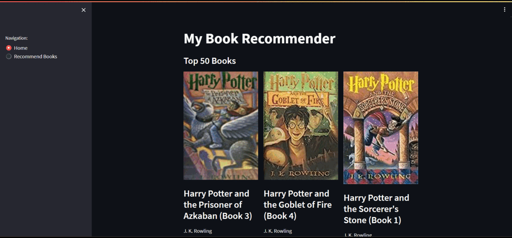

# Book Recommender System

**Book Recommender System** is a personalized recommendation solution designed for avid book enthusiasts.


## Project Demo 🎥



## Table of Contents
- [Introduction](#introduction)
- [Problem Statement](#problem-statement)
- [Tools and Technologies Used](#tools-and-technologies-used)
- [Approaches Used](#approaches-used)
- [Instructions to Run](#instructions-to-run)
- [Contributing](#contributing)


## Introduction

The **Book Recommender System** is a powerful tool that delivers personalized book recommendations based on user preferences and ratings. Leveraging advanced algorithms and techniques, this system helps readers discover exciting new books that align with their interests.


## Problem Statement

In the digital age, the overwhelming abundance of available books can make it challenging for readers to find titles that resonate with their tastes. The **Book Recommender System** addresses this issue by analyzing user ratings and utilizing machine learning to offer relevant and captivating book suggestions.


## Tools and Technologies Used ⚙️

The **Book Recommender System** is developed using the following tools and technologies:

- Python
- Pandas
- NumPy
- Streamlit
- Flask


## Approaches Used

The **Book Recommender System** employs two primary approaches to offer personalized book recommendations:

1. Popularity-Based Recommendation:
   - Weighted Average Rating
   - Country-wise Analysis
   - Author-wise Analysis

2. Collaborative Filtering:
   - Memory-Based Approach (K-Nearest Neighbors)


## Instructions to Run 🏃‍♂️

1. Clone the repository:

```bash
git clone https://github.com/abhisri15/Book-Recommender-System.git
cd Book-Recommender-System
```

2. Install dependencies:

```bash
pip install -r requirements.txt
```

3. Run the Streamlit app:

```bash
streamlit run main.py
```

4. Alternatively, you can run the Flask app:

```bash
python app.py
```


## Contributing 🛂

Feel free to contribute to this project by submitting pull requests or suggesting improvements.
